# AureaCare — Guida rapida al mockup

## Che cos'è questo documento

Una guida illustrata a **tutte le funzionalità** del mockup AureaCare, schermata per schermata, con immagini catturate dal prototipo reale. Serve a far capire il prodotto a chi non l'ha mai visto, a mostrare come ogni schermata risponde a un requisito del programma Carelink, e a rendere evidenti le scelte ancora aperte.

Il mockup è un **prototipo navigabile**, non un prodotto.

---

# Parte 1 — L'app del paziente

## 1.1 Accesso con credenziali

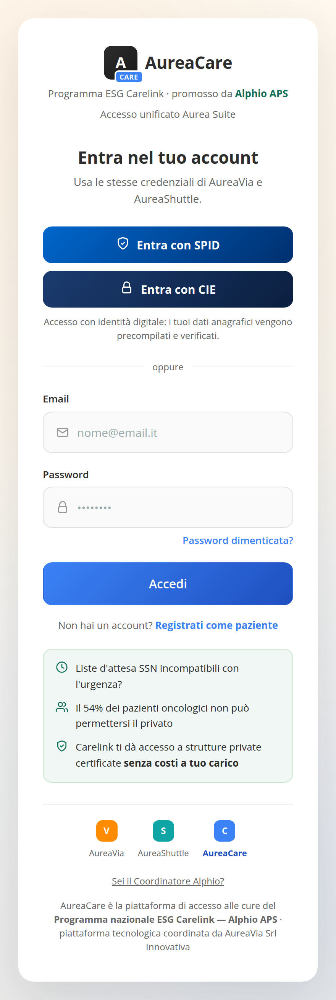

La schermata di ingresso dichiara subito di cosa si tratta.

L'accesso avviene con le sole **credenziali**. *SPID e CIE sono stati rimossi su indicazione del committente: gli screenshot di questa guida sono anteriori alla revisione e li mostrano ancora, quindi vanno rigenerati insieme al PDF allegato.*

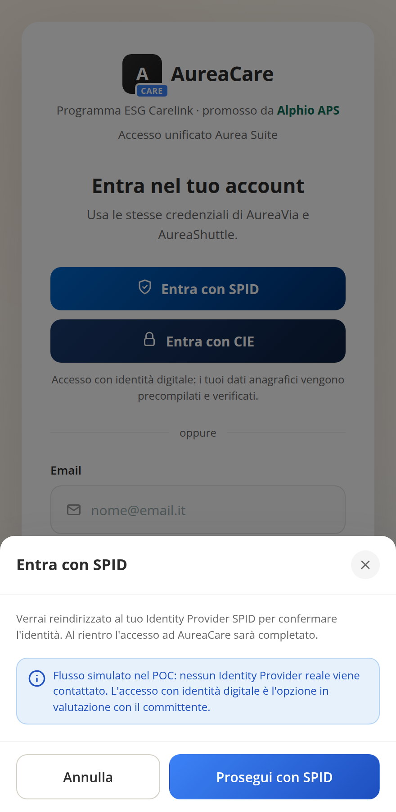

Il click su *Entra con CIE* apre la conferma di reindirizzamento al servizio di autenticazione.

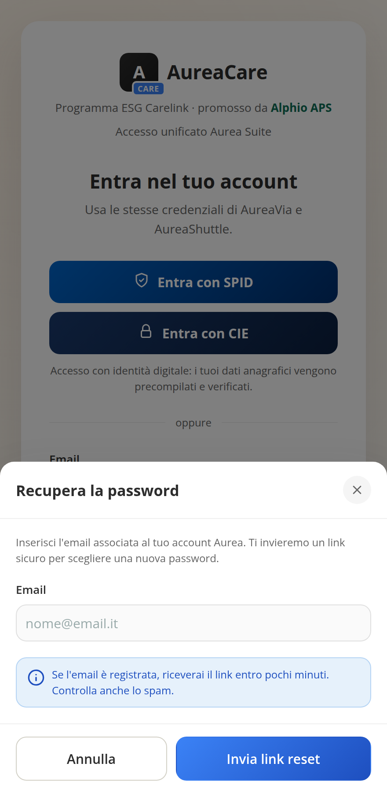

È presente anche il **recupero della password**, con invio simulato del link di reset.

## 1.2 Registrazione: un wizard in 5 passi

La registrazione raccoglie ciò che serve al Coordinatore per decidere, e nulla di più.

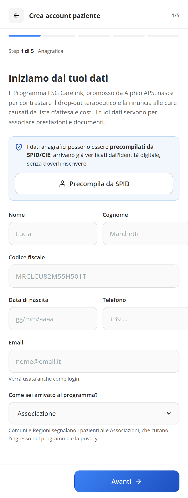

**Passo 1 — Dati e provenienza.** Oltre all'anagrafica si chiede *come sei arrivato al programma*.

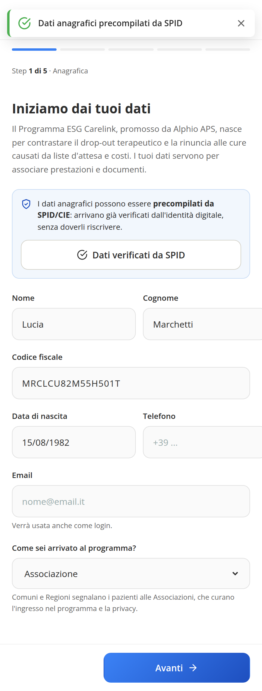

Con la CIE l'anagrafica si **precompila** invece di essere digitata: nome, cognome, codice fiscale, data di nascita e residenza arrivano dall'identità digitale.

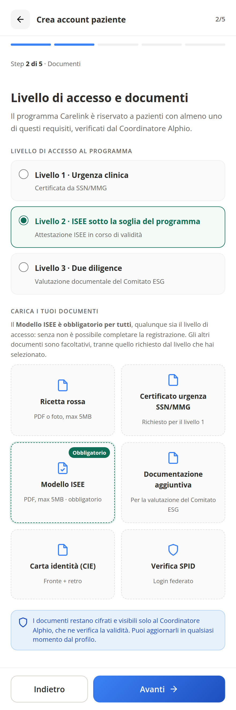

**Passo 2 — Livello di accesso e documenti.** Qui il paziente dichiara **per quale dei tre canali** entra nel programma: urgenza clinica certificata da SSN/MMG, ISEE sotto la soglia, oppure due diligence del Comitato. La scelta **marca dinamicamente come richiesto** il documento corrispondente: chi sceglie l'urgenza vede diventare necessario il certificato SSN/MMG, chi sceglie la due diligence la documentazione aggiuntiva per il Comitato.

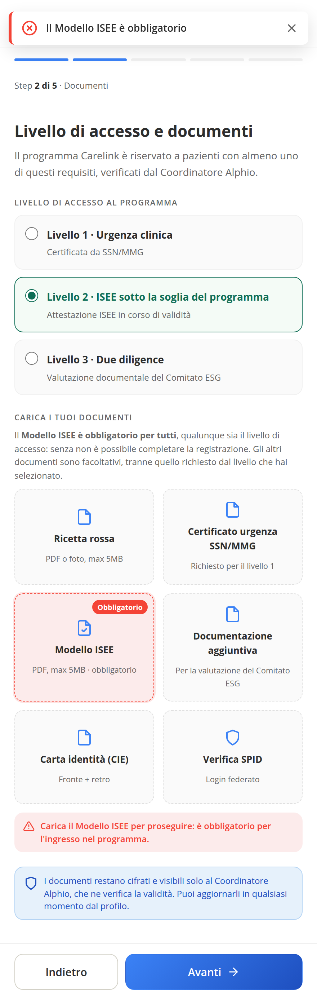

**Il Modello ISEE è obbligatorio e il suo caricamento è bloccante.** Non è un'etichetta decorativa: senza il caricamento la registrazione non prosegue. La scheda si evidenzia in rosso, compare l'errore in linea e un avviso spiega perché ci si è fermati.

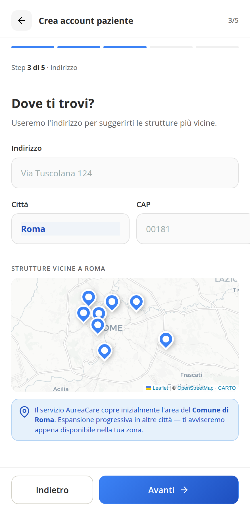

**Passo 3 — Indirizzo.** Serve per due ragioni: proporre le strutture più vicine e, soprattutto, sapere **da dove partirà il trasporto porta a porta**. La mappa mostra la copertura attuale, il Comune di Roma.

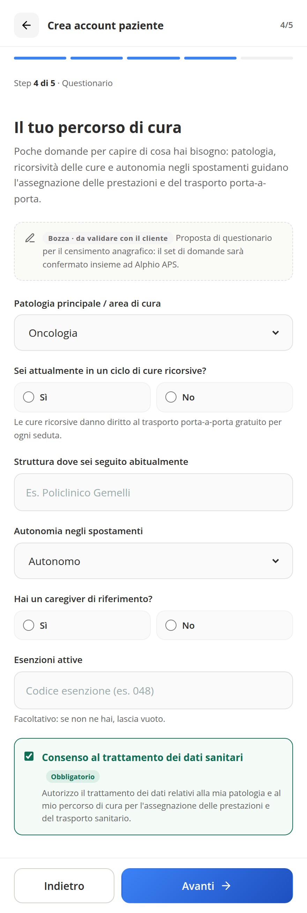

**Passo 4 — Il questionario di censimento.** Poche domande che orientano tutto il resto: patologia principale, se il paziente è in un **ciclo di cure ricorsive** (è la condizione che dà diritto al trasporto gratuito — e in tal caso compare un campo per la **frequenza** delle sedute), dove è seguito abitualmente, la sua **autonomia negli spostamenti**, se ha un caregiver, le esenzioni attive.

Chiude il **consenso al trattamento dei dati sanitari**, che è a sua volta **bloccante**: senza, il wizard non prosegue.

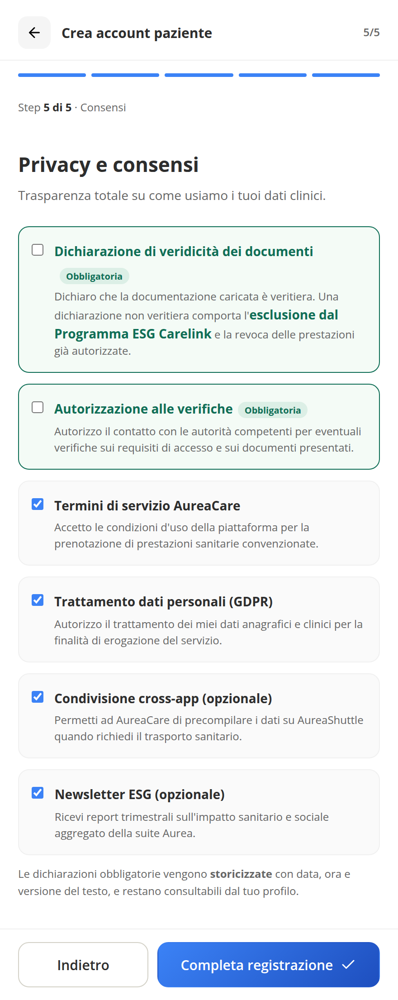

**Passo 5 — Privacy e dichiarazioni.** Le due dichiarazioni richieste dal cliente: il paziente **dichiara che la documentazione caricata è veritiera** e **autorizza il contatto con le autorità competenti** per eventuali verifiche. Il testo è esplicito sulle conseguenze di una dichiarazione mendace: esclusione dal programma e revoca delle prestazioni già autorizzate.

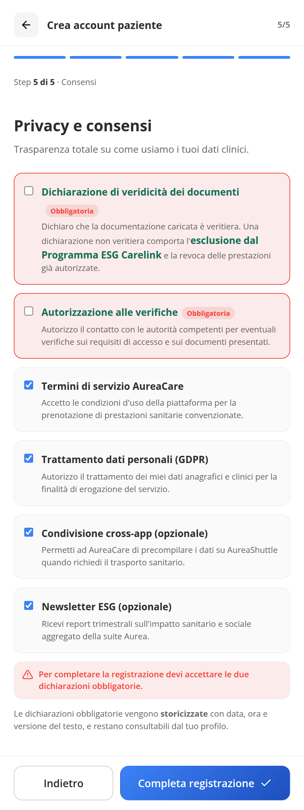

Anche queste **bloccano**: senza entrambe le spunte la registrazione non si completa.

Nel modello, le dichiarazioni vanno **storicizzate** — data, ora e versione del testo accettato — perché una dichiarazione senza traccia non ha valore in una verifica.

## 1.3 Home: lo stato del programma, non un saldo

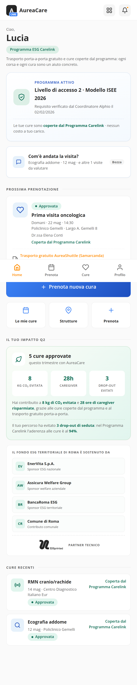

La home dice al paziente tre cose: **che il programma è attivo** su di lui e con quale livello di accesso, **qual è la prossima cura** e come ci arriverà, e **che impatto sta generando** il suo percorso.

Dove un'app tradizionale metterebbe un saldo, qui c'è una garanzia: *«Le tue cure sono coperte dal Programma Carelink · nessun costo a tuo carico»*. Nessun conteggio di voucher, nessun euro.

L'impatto personale è raccontato in termini non monetari — **CO₂ evitata, ore di caregiver liberate, drop-out di seduta evitati** — perché è ciò che ha senso per chi è in cura. In fondo, gli **sponsor del Fondo ESG** che rendono possibile il programma.

Se esiste una visita già svolta per cui il paziente non ha ancora risposto al questionario, la home mostra da sola un banner **«Com'è andata la visita?»** che porta al follow-up.

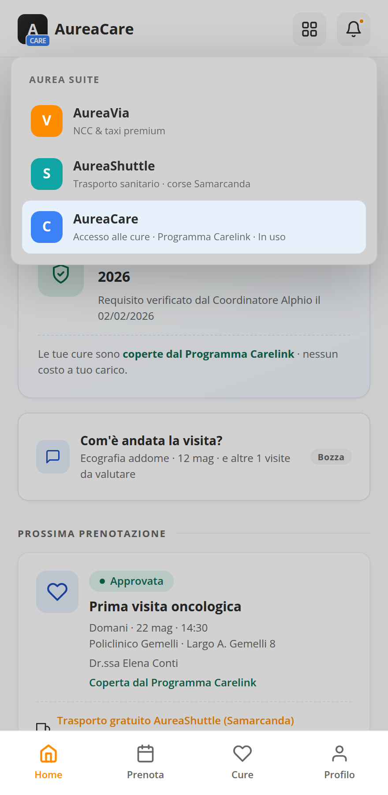

L'**app switcher** collega le tre app della suite: AureaVia, AureaShuttle e AureaCare, con sessione condivisa (SSO simulato). È il ponte verso il trasporto.

## 1.4 Catalogo: le prestazioni della Convenzione

Il catalogo espone **esattamente** ciò che la Convenzione Terzo Settore prevede, in tre famiglie. Una ricerca libera filtra per prestazione o specialità, e ogni card dichiara quante strutture la offrono a Roma.

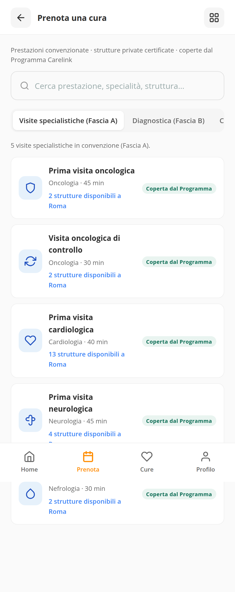

**Fascia A — visite specialistiche.** Prima visita oncologica, visita oncologica di controllo, prima visita cardiologica, prima visita neurologica, visita nefrologica. Ognuna riporta la durata e la pill verde **«Coperta dal programma»**: al posto del prezzo, la garanzia.

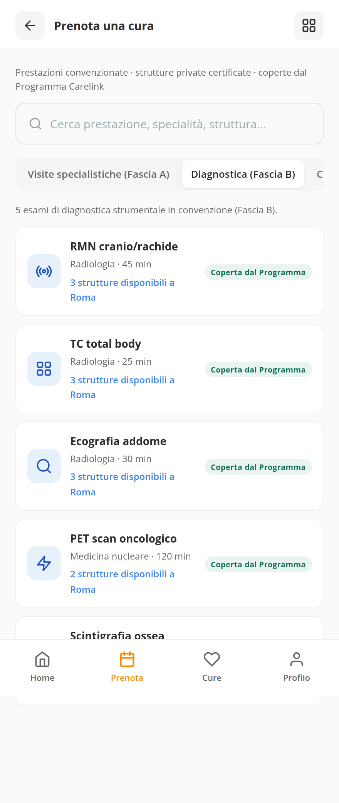

**Fascia B — diagnostica strumentale.** RMN cranio/rachide, TC total body, ecografia addome, PET scan oncologico, scintigrafia ossea. Sono le prestazioni economicamente più pesanti.

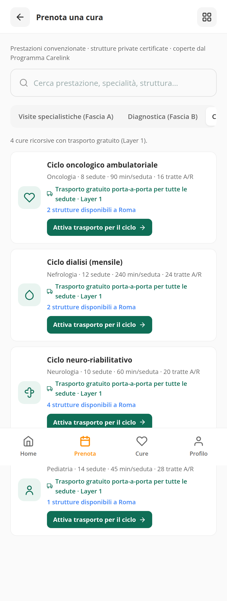

**Cure ricorsive — il Layer 1.** Ciclo oncologico ambulatoriale, dialisi, neuro-riabilitazione, riabilitazione pediatrica. Non hanno prezzo perché **il programma non copre la cura, ma il viaggio**: sono percorsi terapeutici già in corso, e ciò che si attiva dal catalogo è il **trasporto porta a porta gratuito per ogni seduta**, andata e ritorno. Un ciclo di dialisi da 12 sedute significa 24 tratte coperte. Il percorso di attivazione passa dallo stesso flusso delle altre prestazioni: struttura, data, ricetta.

## 1.5 Strutture: private, certificate, vicine

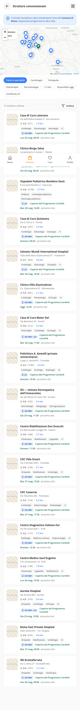

Le strutture convenzionate di Roma — **17 attive delle 18 in rete**, perché il Coordinatore può disattivarne una dalla console — su lista e su mappa, con distanza dal paziente e prima disponibilità indicativa. Ognuna mostra la **certificazione ISO 9001 o JCI**: è il requisito di ammissione alla rete, e l'unica cosa che il paziente ha davvero bisogno di sapere sulla qualità del posto in cui andrà.

I filtri permettono di restringere per specialità, prossimità (≤ 5 km), disponibilità immediata e **certificazione JCI**.

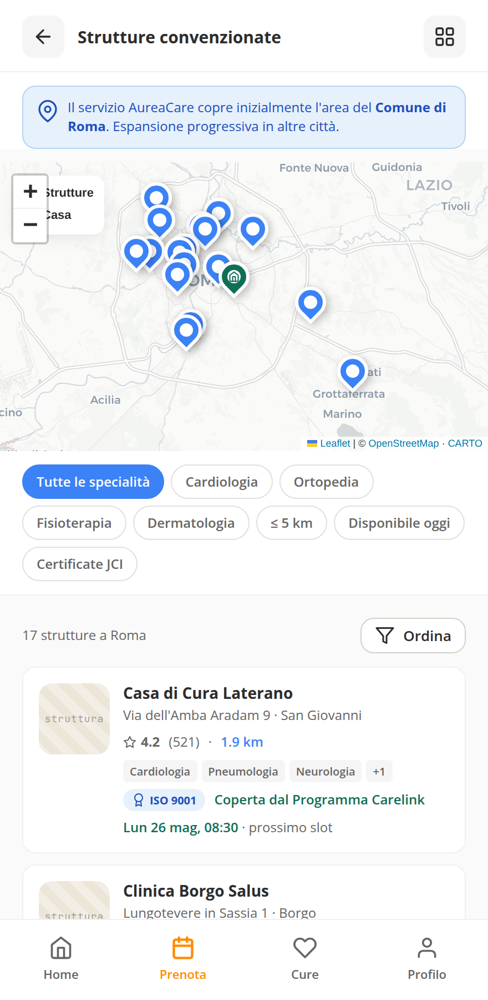

Un pannello dedicato ordina la rete per **distanza, valutazione, certificazione o disponibilità indicativa**.

## 1.6 Prenotazione: la ricetta è il presupposto clinico

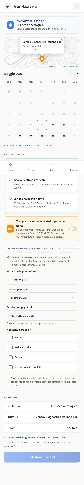

Alla prima apertura il pulsante di conferma è **spento**: manca la preferenza di giorno e fascia. Il riepilogo in alto mostra la prestazione e la struttura scelte davvero (qui una PET al Centro Diagnostico Italiano Eur), con la riga *«Coperta dal Programma Carelink · nessun costo a tuo carico»*. Una mini-mappa traccia il percorso da casa alla struttura.

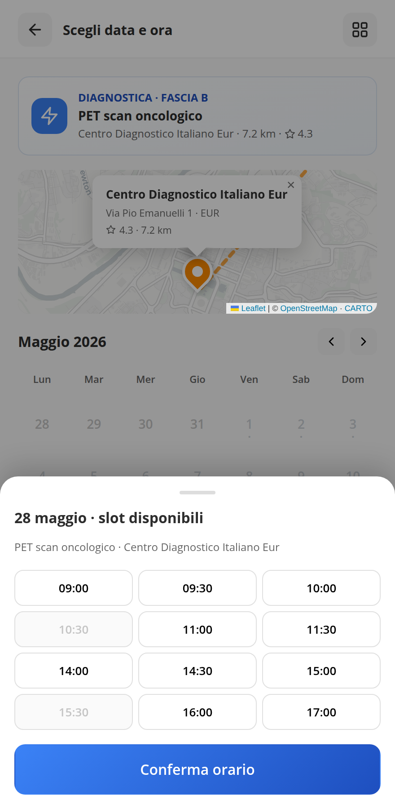

Il calendario propone i giorni di apertura della struttura e apre le **fasce orarie preferite** — mattina, ora di pranzo, pomeriggio, tardo pomeriggio, indifferente. Non sono slot prenotabili: la piattaforma non è collegata alle agende delle strutture, e l'orario esatto lo concorda il Coordinatore. Cambiare giorno **invalida** la fascia già scelta, così il riepilogo non resta mai indietro. *(Gli screenshot di questa guida sono anteriori alla revisione e mostrano ancora gli slot puntuali: vanno rigenerati.)*

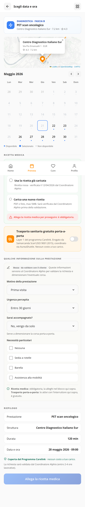

Scelta la fascia, il pulsante **resta bloccato** e cambia messaggio: *«Allega la ricetta medica»*. È il secondo requisito chiesto dal cliente: **senza ricetta non si prenota**, perché è il presupposto clinico della prestazione e senza di essa il Coordinatore non può validare nulla. Il paziente può **riusare la ricetta già verificata** o caricarne una nuova.

Nella stessa schermata, il **questionario di prenotazione** raccoglie il motivo della prestazione, l'**urgenza percepita**, se il paziente **sarà accompagnato** e se ha **necessità particolari** (sedia a rotelle, barella, assistenza): sono le informazioni che dimensionano la corsa. Il **trasporto** si attiva con un interruttore dedicato, subito sopra il questionario.

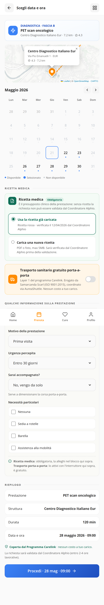

Solo con **preferenza e ricetta insieme** il pulsante si accende e mostra giorno e fascia scelti.

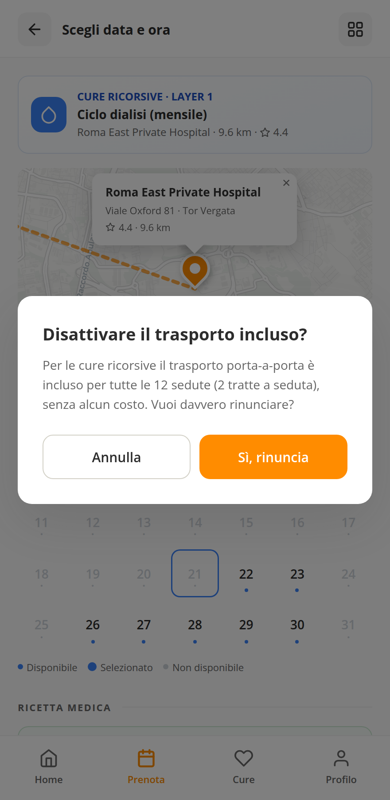

Per una **cura ricorsiva** il trasporto è **pre-attivato**, e disattivarlo richiede una conferma esplicita: rinunciare al trasporto in un ciclo di dialisi è esattamente il comportamento che il programma esiste per evitare.

## 1.7 Riepilogo e passaggio ad AureaShuttle

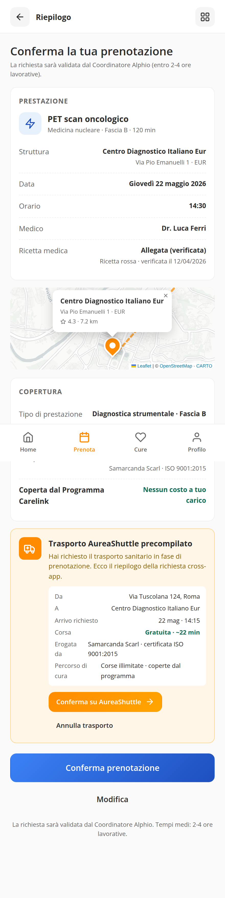

Il riepilogo conferma prestazione, struttura, data, ricetta allegata e copertura. Il trasporto è descritto per quello che è: **gratuito, porta a porta, erogato da Samarcanda Scarl (ISO 9001:2015)**. La richiesta andrà al **Coordinatore Alphio** per la validazione, non a un generico "amministratore".

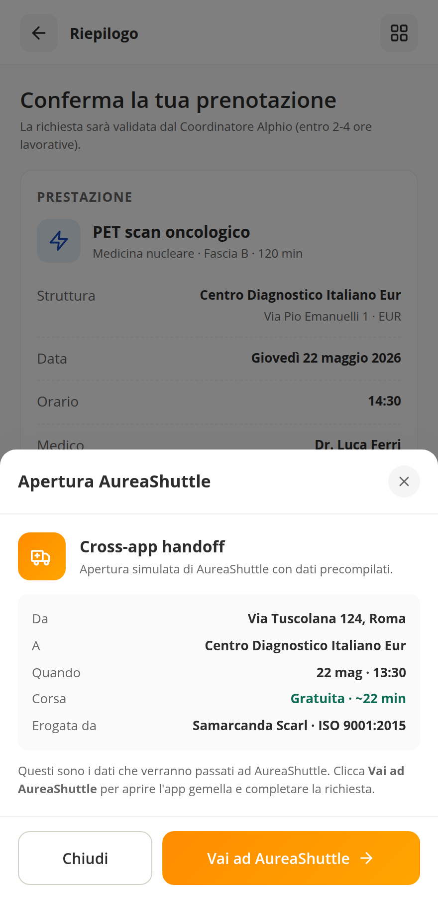

Il passaggio ad **AureaShuttle** arriva già compilato con partenza da casa, arrivo alla struttura e giorno dell'appuntamento. *(L'orario di prelievo viene calcolato da AureaShuttle quando il Coordinatore ha confermato l'orario dell'appuntamento.)* È il punto di giunzione tra i due layer del programma — la cura e il modo di arrivarci — e attraversa due app della suite senza che il paziente debba reinserire nulla.

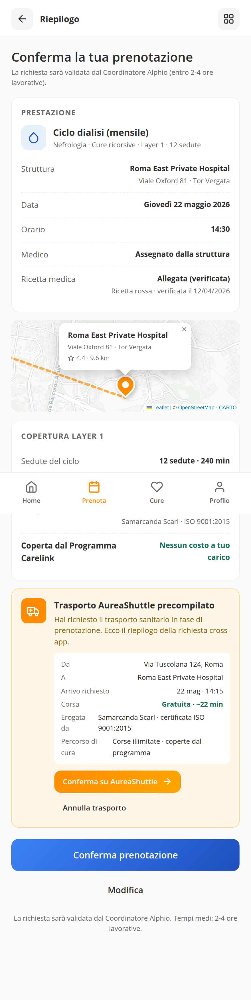

Per una cura ricorsiva il riepilogo cambia natura: non c'è un voucher, c'è un ciclo di sedute con le relative tratte di andata e ritorno, tutte coperte.

## 1.8 Le mie cure: due soli stati

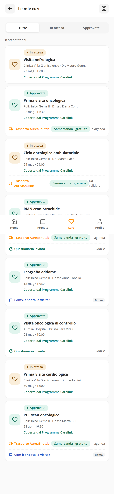

Le prenotazioni hanno **solo due stati**, come richiesto dal cliente: **In attesa** e **Approvata**. Niente "confermata", "completata" o "annullata": al paziente interessa sapere se la sua richiesta è passata, non seguire una macchina a stati. Un filtro permette comunque di vedere solo le une o solo le altre.

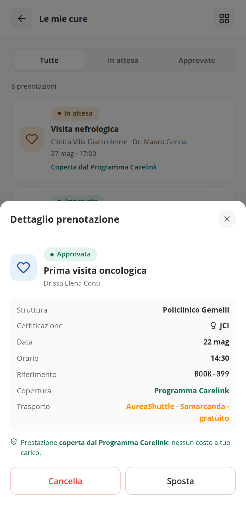

Il dettaglio mostra struttura, medico, data, certificazione e la copertura del programma. Le azioni cambiano con lo stato: una richiesta in attesa si può **annullare**, una approvata si può **spostare** (si torna al calendario), una visita già svolta apre il **questionario**.

## 1.9 Il questionario post-visita

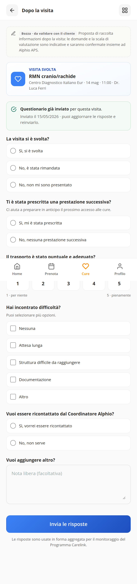

È la terza raccolta di informazioni chiesta dal cliente: **dopo la visita**. Compare sulle visite approvate con data ormai passata, ed è l'unico modo per sapere ciò che nessun sistema registra da solo — se la visita **si è svolta davvero**, se è stata prescritta una prestazione successiva, se il **trasporto è stato adeguato** (la domanda si disattiva se la corsa non era prevista), quali difficoltà sono emerse, se il paziente vuole essere **ricontattato dal Coordinatore**.

È il punto in cui il programma potrà misurare il suo obiettivo vero, il **drop-out terapeutico evitato**: il questionario raccoglie il dato alla fonte.

## 1.10 Profilo: le dichiarazioni e il loro storico

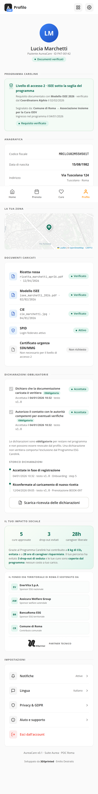

Il profilo raccoglie anagrafica, documenti, livello di accesso e **da chi è stato segnalato** il paziente. La parte nuova è la card delle **dichiarazioni obbligatorie**: le due dichiarazioni accettate, con **data, ora e versione del testo**, il loro **storico** (prima accettazione in registrazione, riconferma al caricamento di una nuova ricetta) e una **ricevuta scaricabile**.

Se un domani si dovesse verificare una dichiarazione, serve sapere *cosa* è stato accettato e *quando*, non solo che una casella era spuntata.

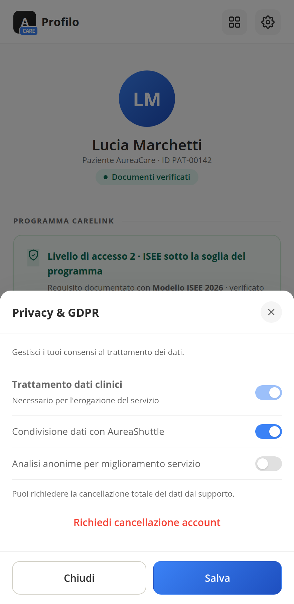

Il profilo include anche i pannelli di **impostazioni** funzionanti: notifiche, lingua, **privacy e GDPR** — con la richiesta di cancellazione dell'account — e supporto.

---

# Parte 2 — La console del Coordinatore Alphio

Sette schermate desktop. Qui vive tutto ciò che il paziente non deve vedere: il denaro, i voucher, il fondo, la rendicontazione.

## 2.1 Accesso alla console

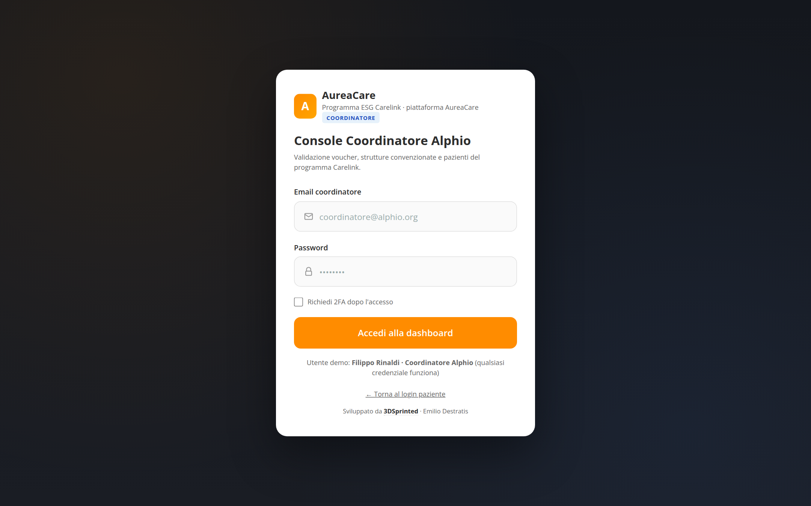

La console si presenta per quello che è: la postazione del **Coordinatore Alphio**, il ruolo che nel documento gestisce l'onboarding, valida i voucher, coordina le corse e produce la reportistica ESG.

## 2.2 Dashboard

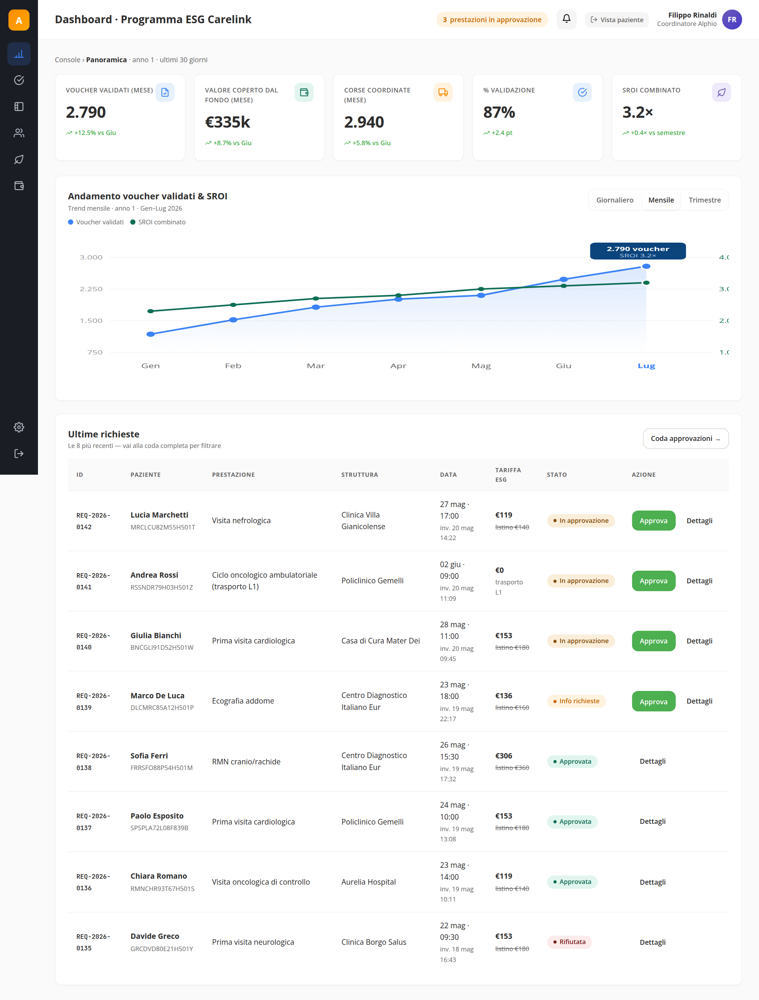

Il polso del programma: **voucher validati** nel mese, **valore coperto dal Fondo**, **corse coordinate**, tasso di validazione e **SROI combinato**. Il grafico incrocia voucher erogati e ritorno sociale nel tempo, con vista giornaliera, mensile o trimestrale. Sotto, le **ultime richieste** arrivate, con approvazione rapida senza passare dalla coda.

## 2.3 Coda approvazioni: validare un voucher

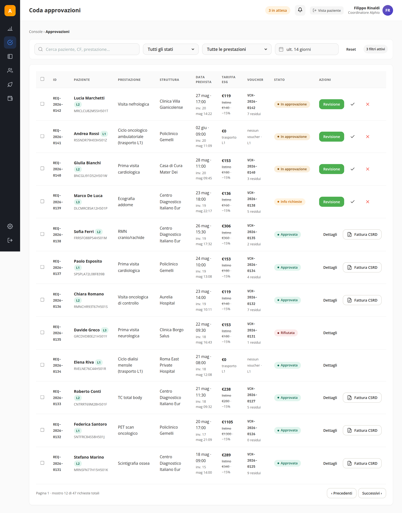

Il cuore operativo. Ogni riga è una richiesta con il suo **livello di accesso** (L1, L2, L3), il voucher associato e i residui del paziente. La barra in alto filtra per testo, stato, tipo di prestazione e intervallo di date; le richieste si possono selezionare in blocco, approvare o rifiutare al volo, oppure rimandare al mittente con **richiesta di integrazioni**. Gli stati previsti sono quattro: in attesa, approvata, rifiutata, info richieste.

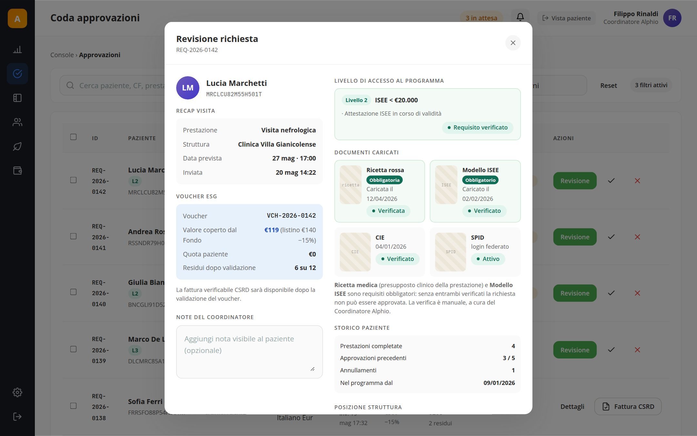

Il modale di revisione è dove il Coordinatore **decide**. Contiene tutto ciò che serve:

- **il recap della visita** — prestazione, struttura, data;
- **il voucher ESG** — l'ID, il **valore coperto dal Fondo** con il **listino** da cui deriva e lo **sconto del 15%**, la **quota paziente a €0** e i residui dopo la validazione;
- **il livello di accesso** con il requisito verificato — qui la soglia **ISEE < €20.000** è scritta per esteso, perché è chi decide a doverla leggere;
- **i documenti**, con *Ricetta medica* e *Modello ISEE* marcati **Obbligatori**: senza entrambi verificati la richiesta non può essere approvata;
- lo **storico del paziente**, la **posizione della struttura** su mappa, un avviso quando la richiesta comporta anche una corsa AureaShuttle da coordinare, e le note del Coordinatore.

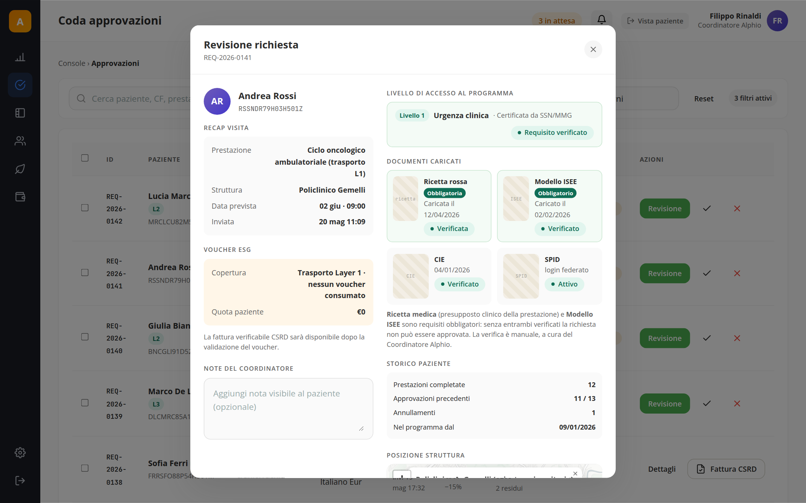

Una richiesta di **solo trasporto (Layer 1)** si presenta diversamente: al posto del voucher c'è il blocco *«Trasporto Layer 1 · nessun voucher consumato»*, con la quota paziente sempre a €0. È la differenza sostanziale tra i due layer, resa visibile.

## 2.4 Rete delle strutture

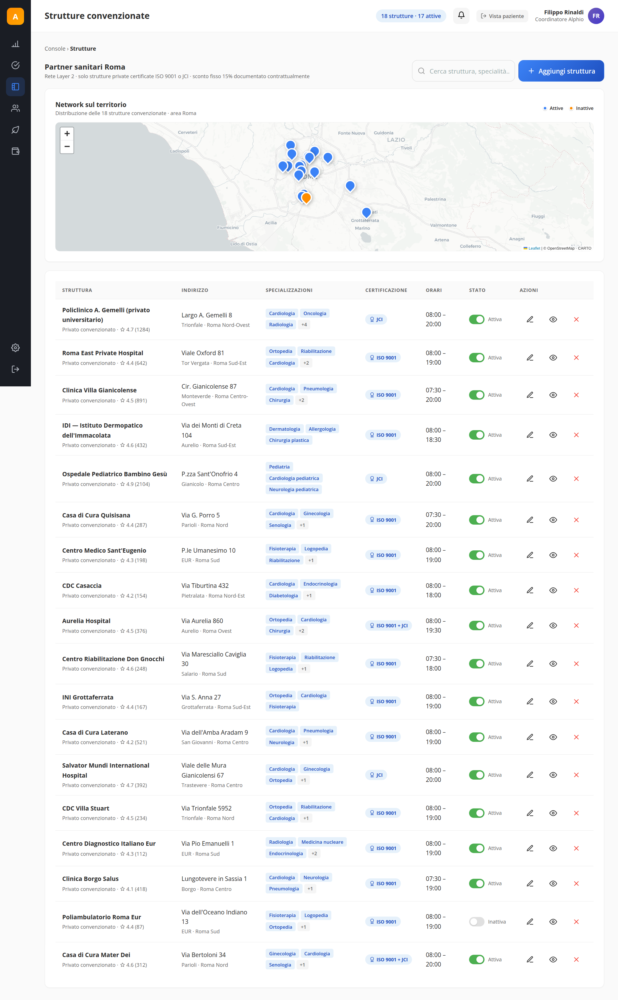

Le 18 strutture convenzionate: **tutte private, tutte certificate** ISO 9001 o JCI. Non è un dettaglio anagrafico ma il criterio di ammissione alla rete del Layer 2. La mappa mostra il network sul territorio; il Coordinatore può **attivare, disattivare, aggiungere o rimuovere** una struttura.

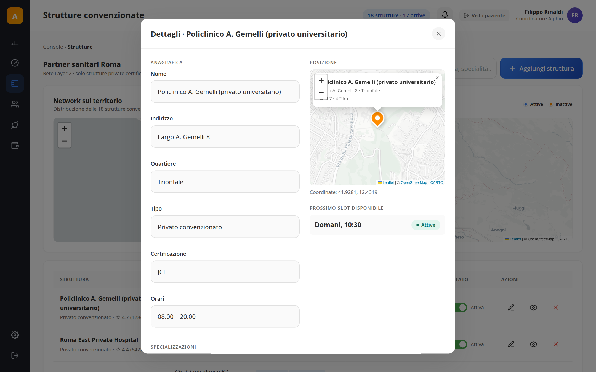

Il dettaglio riporta anagrafica e specialità, i **KPI della struttura** (valutazione, recensioni, distanza, certificazione), la posizione su mappa, la disponibilità indicativa comunicata e la conferma che il **listino ufficiale è depositato e verificato**: è la base su cui si applica lo sconto contrattuale del 15%, ed è ciò che rende la tariffa ESG verificabile invece che dichiarata.

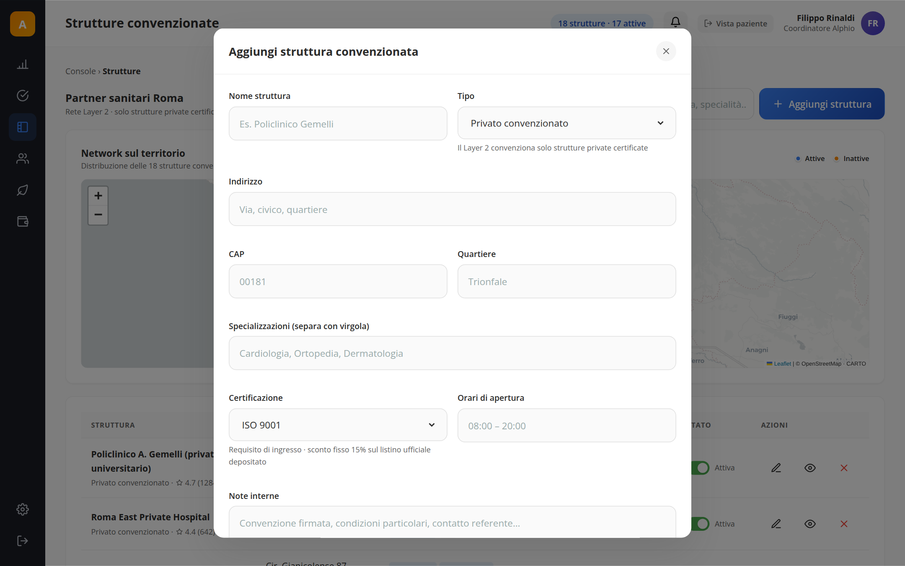

Il form di inserimento chiede la **certificazione** come campo obbligatorio: una struttura senza ISO 9001 o JCI non entra nella rete.

## 2.5 Pazienti

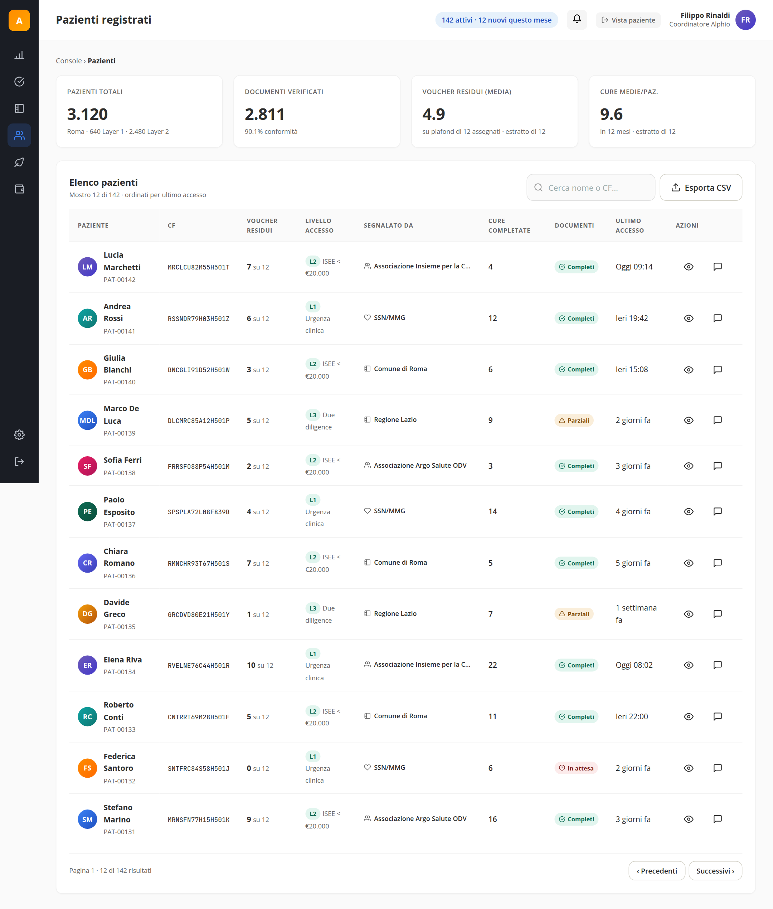

I pazienti del programma con voucher residui, livello di accesso e **canale di segnalazione** — Comune, Regione, Associazione o SSN/MMG. In testa i KPI dell'anagrafica; l'elenco si **esporta in CSV**.

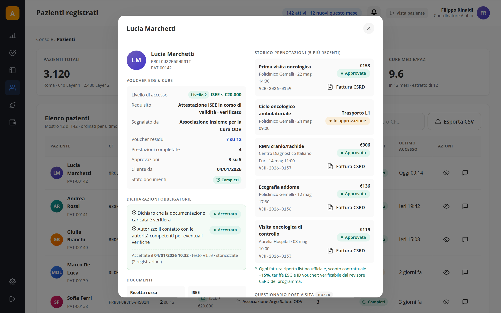

La scheda del singolo paziente raccoglie tutto ciò che serve per una verifica: livello di accesso e requisito, **chi lo ha segnalato**, voucher residui, **le dichiarazioni obbligatorie con il loro storico** (versione del testo, numero di registrazioni — dettagliato sul paziente dimostrativo), i documenti, lo **storico delle prestazioni**, l'**impatto ESG** attribuibile al paziente e l'esito del **questionario post-visita**.

Da qui si scarica la **fattura verificabile CSRD** di ogni prestazione di Fascia A/B validata; le richieste di solo trasporto, prive di voucher, hanno una loro variante del documento.

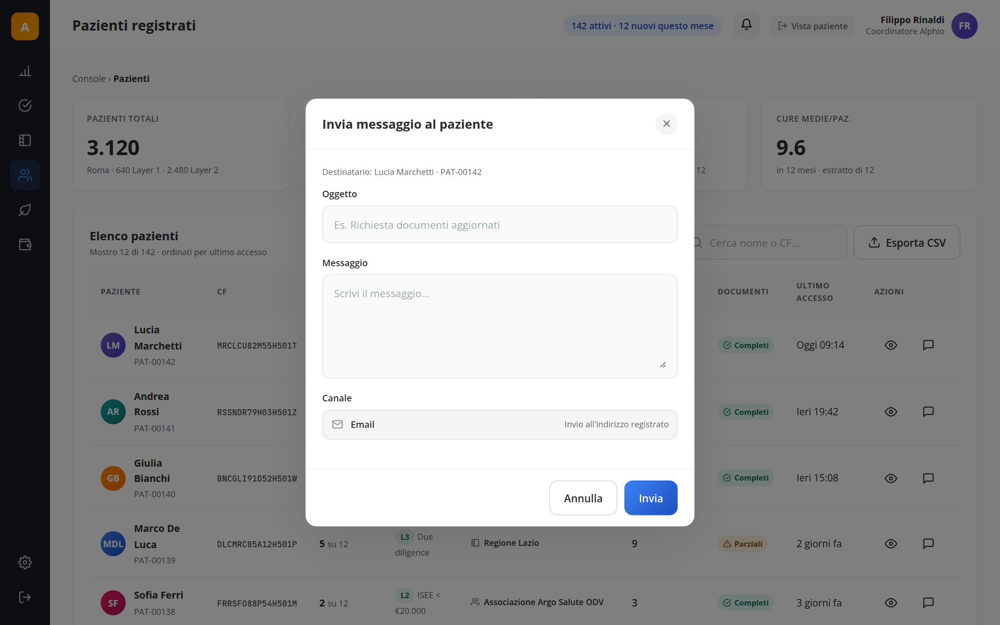

Il Coordinatore può **scrivere al paziente**: il canale è l'email, unico mezzo di comunicazione tracciabile previsto dal flusso.

## 2.6 KPI ESG: l'impatto del programma

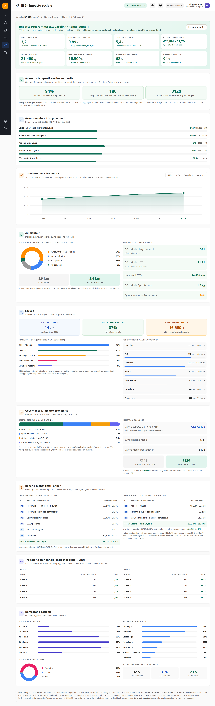

La rendicontazione che il programma deve agli sponsor e alle istituzioni:

- **SROI distinto per layer** — la mobilità (Layer 1) è vicina al pareggio sociale, l'accesso alle cure (Layer 2) moltiplica per diverse volte ogni euro investito, e il combinato sta nella forbice prevista dal documento;
- **aderenza terapeutica e drop-out evitati** — l'obiettivo fondante del programma;
- **benefici monetizzati** voce per voce: minori costi per il SSN, risparmio diretto per i pazienti, tempo di caregiver liberato, QALY e WELLBY;
- **impatto ambientale** — tonnellate di CO₂ evitate, equivalente in alberi, e la ripartizione dei modi di trasporto verso le strutture;
- **dimensione sociale** — fragilità servite, copertura per quartieri di Roma, tasso di accesso facilitato;
- **governance economica** — composizione dello SROI, valore coperto dal Fondo, e la **traiettoria pluriennale** che lega l'incidenza dei costi al ritorno sociale su quattro anni;
- **demografia** dei pazienti e avanzamento sui **target dell'anno 1**.

Il grafico di trend è commutabile per metrica e il report si **esporta in CSV**.

## 2.7 Fondo ESG Territoriale

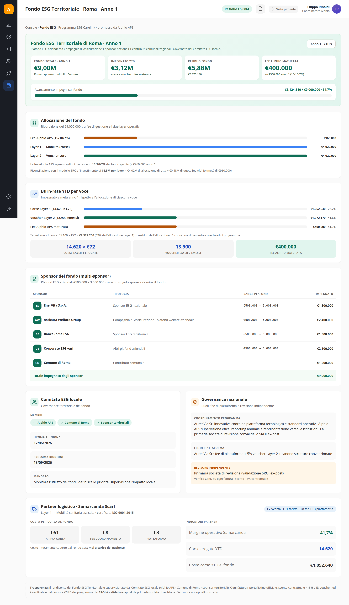

Il rendiconto del **Fondo ESG Territoriale di Roma**, circa **9 milioni** per l'anno 1:

- **allocazione** — la fee di Alphio APS a scaglioni decrescenti (15/10/7%) e i due layer, finanziati in misura paritaria;
- **burn-rate** — quanto è stato impegnato finora in corse, voucher e fee, e quanto resta, con la barra di avanzamento degli impegni;
- **multi-sponsor** — i plafond ESG delle aziende (anche via compagnie assicurative), gli sponsor territoriali e il contributo comunale: nessuno domina il fondo;
- **Comitato ESG locale** — Alphio, Comune di Roma e sponsor territoriali, che sorvegliano l'uso dei fondi;
- **governance nazionale** — AureaVia Srl per la piattaforma, Alphio APS per l'etica e il reporting, una società di revisione per la validazione dello SROI;
- **Samarcanda** — il costo per corsa scomposto nelle sue voci e il margine del partner logistico.

---

# Parte 3 — L'hub di review

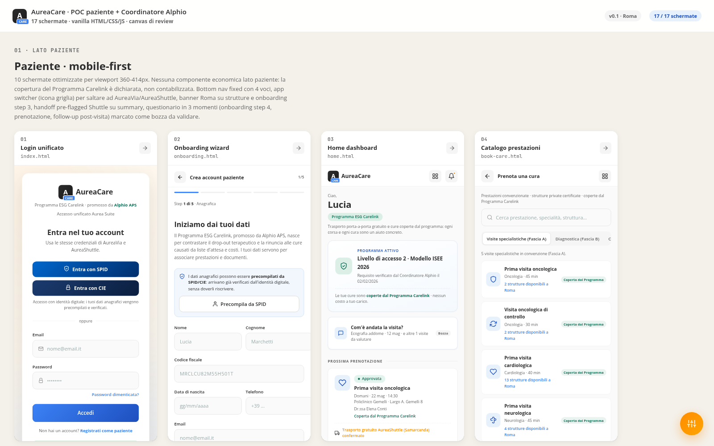

# Regole trasversali

**Il paziente non vede denaro.** In tutte e dieci le schermate paziente non compare un solo simbolo di euro, né un prezzo, uno sconto, un voucher o un saldo. Non è una scelta estetica: il paziente non paga, e mostrargli importi che non deve versare crea solo ansia e confusione. Al loro posto una garanzia esplicita — *coperta dal programma, nessun costo a tuo carico*. Tutto l'apparato economico esiste, ma nella console, dove serve a chi decide e a chi verifica.

**Ciò che è obbligatorio, blocca.** I vincoli chiesti dal cliente non sono etichette: l'**ISEE** ferma la registrazione, il **consenso sanitario** ferma il questionario, le **dichiarazioni** fermano il completamento dell'account, la **ricetta medica** ferma la prenotazione.

**I numeri sono quelli del documento.** Prezzi di listino e tariffe ESG delle dieci prestazioni, sconto del 15%, €72 a corsa, i 9 milioni del fondo, i target dell'anno 1, gli intervalli di SROI: sono presi dal programma Carelink, non inventati.

---

# Appendice — Le 17 schermate

| # | Schermata | File | A cosa serve |
|---|---|---|---|
| 1 | Login | `index.html` | Accesso con credenziali; recupero password |
| 2 | Registrazione | `onboarding.html` | Wizard in 5 passi: dati, livello di accesso e ISEE, indirizzo, questionario, dichiarazioni |
| 3 | Home | `home.html` | Stato del programma, prossima cura, impatto personale, sponsor |
| 4 | Catalogo | `book-care.html` | Fascia A, Fascia B e cure ricorsive |
| 5 | Strutture | `structures.html` | Rete privata certificata, lista, mappa, filtri e ordinamenti |
| 6 | Prenotazione | `booking.html` | Calendario, ricetta obbligatoria, questionario, trasporto |
| 7 | Riepilogo | `booking-summary.html` | Conferma e passaggio ad AureaShuttle |
| 8 | Le mie cure | `my-cures.html` | Prenotazioni in attesa e approvate |
| 9 | Questionario post-visita | `follow-up.html` | Esito della visita e drop-out evitati |
| 10 | Profilo | `profile.html` | Documenti, dichiarazioni, storico, impostazioni |
| 11 | Login console | `admin-login.html` | Accesso del Coordinatore Alphio |
| 12 | Dashboard | `admin-dashboard.html` | Voucher, valore coperto, corse, SROI, ultime richieste |
| 13 | Approvazioni | `admin-approvals.html` | Validazione dei voucher e dei documenti, fattura CSRD |
| 14 | Strutture | `admin-structures.html` | Rete convenzionata, certificazioni, mappa, gestione |
| 15 | Pazienti | `admin-patients.html` | Schede, dichiarazioni, fatture, export, messaggi |
| 16 | KPI ESG | `admin-esg.html` | SROI per layer, drop-out, benefici, ambiente, demografia |
| 17 | Fondo ESG | `admin-fund.html` | Allocazione, sponsor, Comitato, governance, Samarcanda |

